# despr2_4_nginx_php_mysql
## Pasos de la práctica
1. Clonar/crear estructura del proyecto
    + Navega a la carpeta de la práctica:
    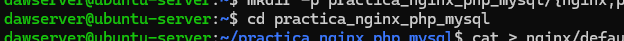

2. (punto 2 y 3) Configuraciones: 
    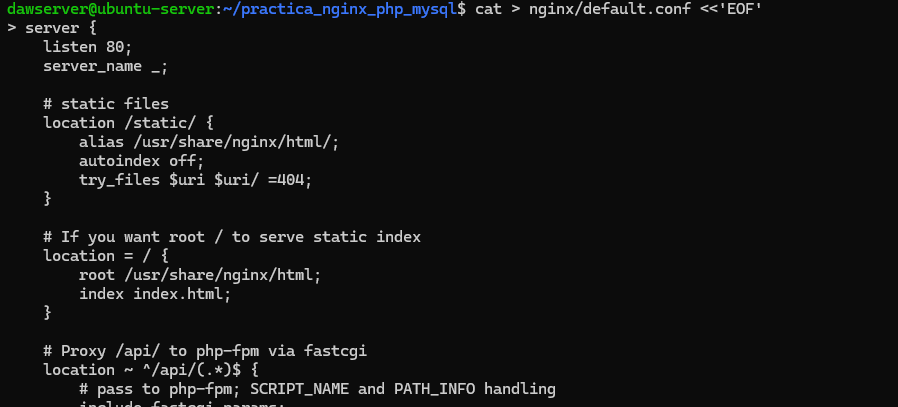
    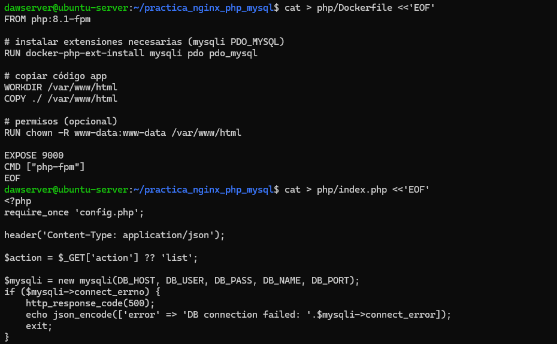
    
    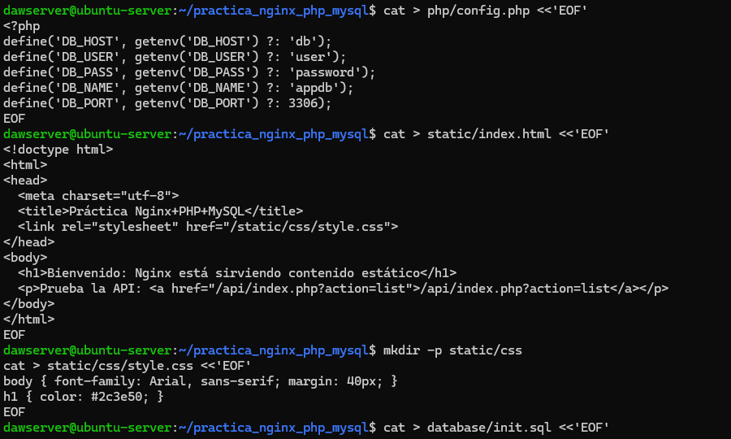
    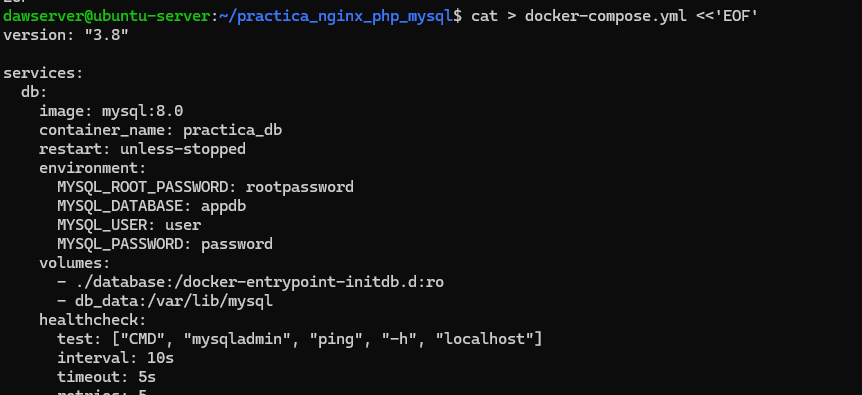

4.Revisar el código php:
    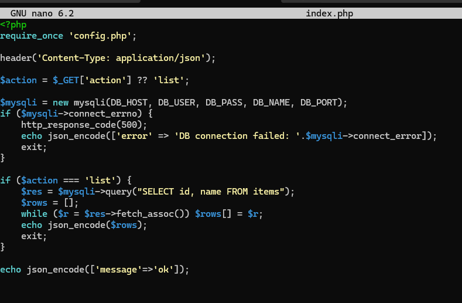

5. Levantar los servicios:
    

6. Verificar que todos los contenedores están corriendo:
    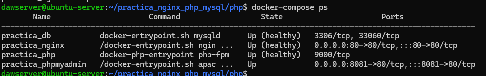

7. Probar el contenido estático:
    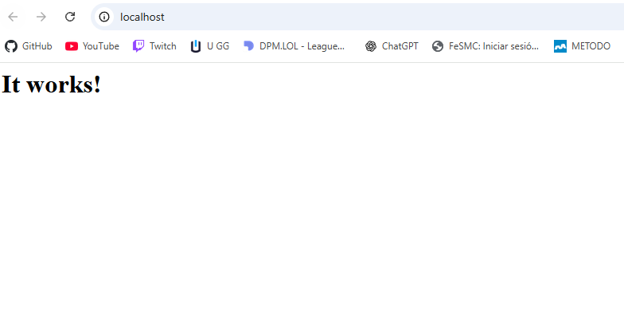

> Del punto 8 al 10 no conseguí que me funcionaran

11. Ver logs de los servicios:
    
    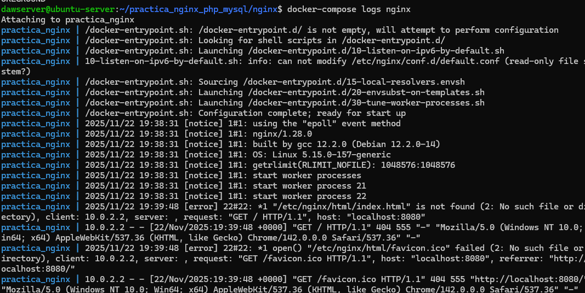
    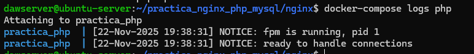
    
    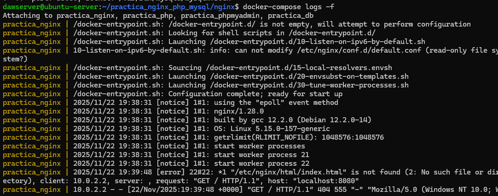

## Problemas encontrados:
No fui capaz de realizar del punto 8 al 10, me daba el error 404 Not Found, intenté borrar todo y empezar de 0 pero me siguió dando ese error.